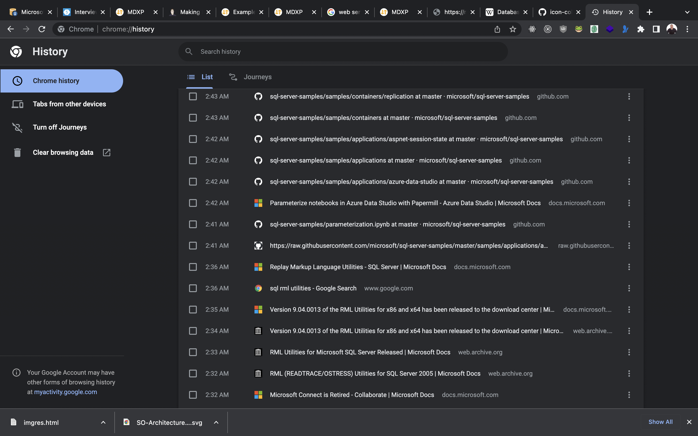
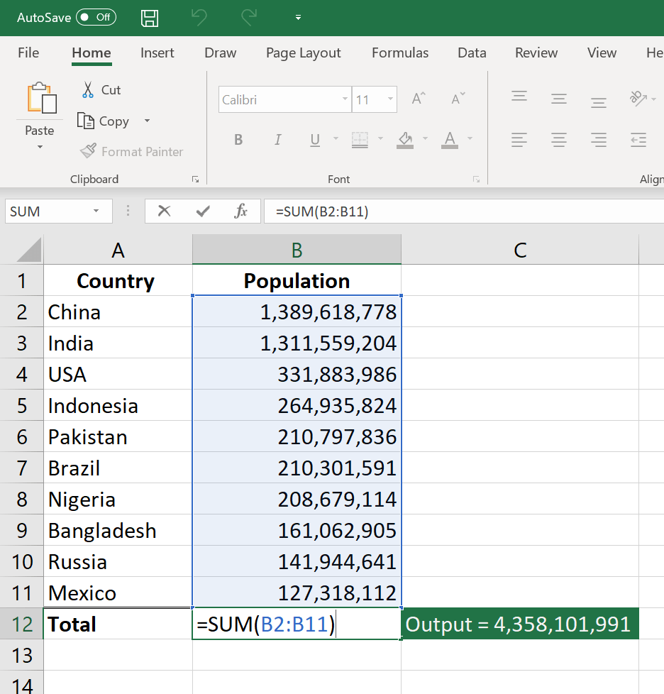

# SQL Server: les bases

Formateur : Eric Côté

---

# Plan de formation

## Jour 1

- Fonctionnement de SQL Server
- Composants de SQL Server
- Installation de SQL Server
- Requêtes de base et travail avec SQL Server

---

# Plan de formation

## Jour 2

- Création d'une Base de Donnée
- Création de table
- Types de Données

---

# Plan de formation

## Jour 3

- Requêtes SQL
- SELECT FROM
- WHERE
- ORDER BY
- TOP
- INNER, OUTER, FULL JOIN

---

# What is a Database?

A collection of information _organized_ in such a way that a computer program can quickly select desired pieces of data.

- Once upon time, programmers stored data on a per app basis (without a separate database)
- This meant coming up with solutions to solve common problems:
  - Data modeling
  - Storage
  - Concurrency
  - Security
  - Audit
- How to share that data whit other programs?
- Shouldn't we try to decouple data and programs?

---

# How does it work?

Modern stack:

  

    
    Browser, Tablet apps, Phone apps, etc
  

  

    
  

  

    
    Web App, App Service, REST API, etc
  

  

    
  

  

    
    SQL Server, Oracle, Postgre, MySQL, Etc
  

---

# How does it work?

Classic stack:

  

    
    Windows Apps, Scripts, Office, SQL Tools, Power BI, etc.
  

  

    
  

  

    
    SQL Server, Oracle, Postgre, MySQL, Etc
  

---

# DBMS

A DBMS is a _Database Management System_. It is a computer program to manage databases.

_SQL Server, Oracle, MySQL Postgres_ are examples of RDBMS. (Relational DBMS)

- There are different DBMS:
- **Hierachical** and **Network** : older approaches that should not be used today
- **Relational**: Most popular, a classic approach from the 1970s. Uses a language named SQL
- **Object**: Became popular with programming languages, but never really caught with databases
- **NoSQL**: a modern approach that doesn't use relations. Popular with startups Where concern is volume instead of complexity. (Twitter)

---

# Types of database systems:

<Block sx={{"&& p" : {textAlign: "left" , marginX: "10%"}}}>

**OLTP**: Online Transaction Processing
A database with transactions (changes). Optimized for read-writes.

**OLAP**: online analytical processing
A database for analysis. Optimized for reads.

</Block>

---

# SQL Server Hierarchy

<Block sx={{"&& p" : {textAlign: "left" , marginX: "10%"}}}>

**OS**: The OS can be physical or virtual

**Sql Server Instance** (or Sql Service): Each instance running will have an exe installed in a folder, a version/cummulative update level, some global settings and security settings, and various network endpoint.

**Database**: A file (or multiple files) containing related data. Each database will have its own settings, db security, backup, etc.

**Schema**: A container of database objets. Groups the objects to manage complexity and manage security

**Object**: Something contained by a database. Ex: Table, View, Function, Stored Procedure, Trigger, etc

**Table**: The most important object. Stores data in rows and columns.

</Block>

---

# Versions of SQL

| product           | version | 10  |
| ----------------- | ------- | --- |
| SQL Server 1.0    | 1989    | 10  |
| SQL Server 4.2    | 1993    | 42  |
| SQL Server 6.0    | 1995    | 60  |
| SQL Server 6.5    | 1996    | 65  |
| SQL Server 7.0    | 1998    | 70  |
| SQL Server 2000   | 8.0     | 80  |
| SQL Server 2005   | 9.0     | 90  |
| SQL Server 2008   | 10.0    | 100 |
| SQL Server 2008R2 | 10.5    | 105 |
| SQL Server 2012   | 11      | 110 |
| SQL Server 2014   | 12      | 120 |
| SQL Server 2016   | 13      | 130 |
| SQL Server 2017   | 14      | 140 |
| SQL Server 2019   | 15      | 150 |
| SQL Server 2022   | 16      | 160 |

---

# SQL Server Editions

---

# SQL Tools

**Configuration Manager**

- Manages Service Status, Service startup and Service Accounts
- Manages Network Endpoints (port numbers, dynamic port, etc)

**Data Quality Server Installer**

- Installs the _Data Quality Server_
- It's a knowledge base to perform a various data quality tasks, including correction, enrichment, standardization, and de-duplication of data
- DQL is used with SSIS (SQL Server Integration Service)

---

# SQL Tools

**Import/Export Data**

- Allows to export-import data with different database technologies
- Generates simple SSIS Tasks that can be modified with the SSIS tooling

**SQL Server Installation Center**

- Launches the installation center, which can setup SQL Server
- Might need the DVD or a network share to complete the file copying.

---

# SQL Tools

**SQL Server Management Studio (SSMS)**

- A program to manage, maintain, develop and query various SQL Server versions
- Compatible with Sql Server 2000-2022 (works better with newer versions.)

**Azure Data Studio**

- SSMS replacement
- Regularly updated

---

# SQL tools

**Analysis Services Deployment Wizard**

- Deploys data to _Analysis Services_ (SSAS)
- _Analysis Services_ allows to store data in data cubes or multi-dimensional databases. There are cloud alternative for Big Data: Hadoop, DataLake, Azure Synapse, etc.

**Database Engine Tuning Advisor**

- Recommends index and partitionning for databases
- Allows optimal performance for your queries

**Profiler**

- Tool to spy what goes on with SQL Server
- Deprecated. Use "Extended Events" instead.

---

# SQL Server Components

| Server feature                          | Description                                                                                                                                                                                                                                                                                                                                                                                              |
| --------------------------------------- | -------------------------------------------------------------------------------------------------------------------------------------------------------------------------------------------------------------------------------------------------------------------------------------------------------------------------------------------------------------------------------------------------------- |
| SQL Server Database Engine              |  SQL Server Database Engine includes the Database Engine, the core service for storing, processing, and securing data, replication, full-text search, tools for managing relational and XML data, in database analytics integration, and PolyBase integration for access to Hadoop and other heterogeneous data sources, and Machine Learning Services to run Python and R scripts with relational data. |
| Analysis Services                       | Analysis Services includes the tools for creating and managing online analytical processing (OLAP) and data mining applications.                                                                                                                                                                                                                                                                         |
| Reporting Services                      | Reporting Services includes server and client components for creating, managing, and deploying tabular, matrix, graphical, and free-form reports. Reporting Services is also an extensible platform that you can use to develop report applications.                                                                                                                                                     |
| Integration Services                    | Integration Services is a set of graphical tools and programmable objects for moving, copying, and transforming data. It also includes the Data Quality Services (DQS) component for Integration Services.                                                                                                                                                                                               |
| Master Data Services                    | Master Data Services (MDS) is the SQL Server solution for master data management. MDS can be configured to manage any domain (products, customers, accounts) and includes hierarchies, granular security, transactions, data versioning, and business rules, as well as an Add-in for Excel that can be used to manage data.                                                                             |
| Machine Learning Services (In-Database) | Machine Learning Services (In-Database) supports distributed, scalable machine learning solutions using enterprise data sources. In SQL Server 2016, the R language was supported. SQL Server 2019 (15.x) supports R and Python.                                                                                                                                                                         |
| Machine Learning Server (Standalone)    | Machine Learning Server (Standalone) supports deployment of distributed, scalable machine learning solutions on multiple platforms and using multiple enterprise data sources, including Linux and Hadoop. In SQL Server 2016, the R language was supported. SQL Server 2019 (15.x) supports R and Python.                                                                                               |
